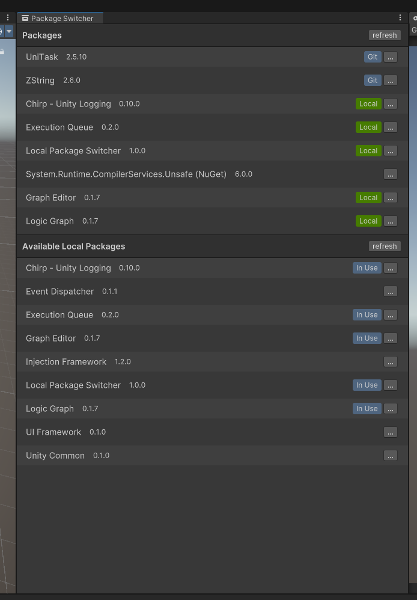
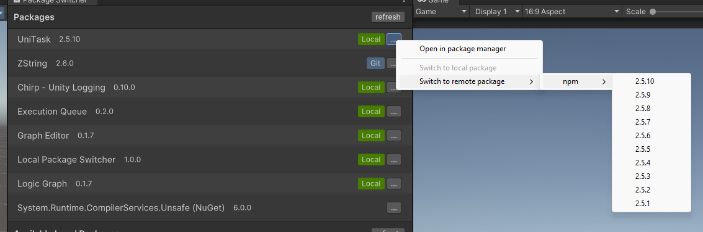
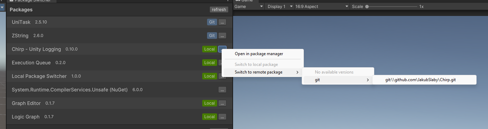
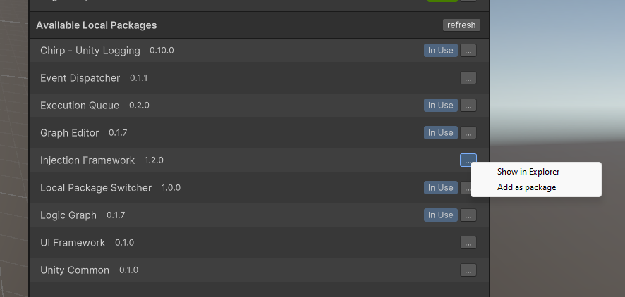
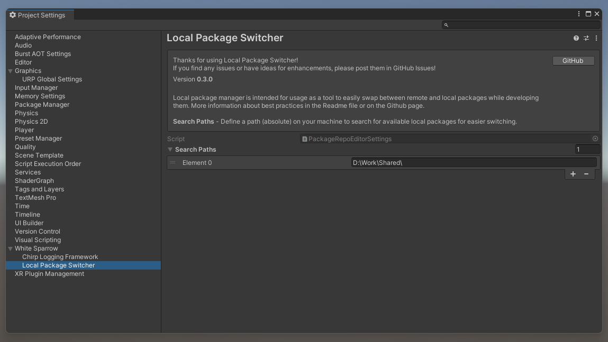

# Local Package Switcher
Tool for making Unity package development a little bit easier by providing a simple interface for it.

## Packages
List of active packages in our project, you can see which are remote or local and switch them around using the `[...]` button.

Available options:
- Show package in Package Manager
- Switch to a local package by selecting it from disk (if currently remote)
- Switch to remote package (if currently local)
  - Displays list of last NPM package versions for quick switching if the package is recognised through a repository index added to your Package Manager.
  - Use github repository link to switch to a git url package

## Available Local Packages
List of packages that are indexed on your drive.

Available options:
- Show in Explorer / Reveal in Finder
- Add as package - will either swap an existing package to this local one, or add as new.

## Configuration
To configure search paths for where to look for local packages, go to Project Settings > White Sparrow > Local Package Switcher.

This is not required though, you can still use switching to a local package by selecting it from disk.

When you specify a path all directories in those paths will be searched recursively for `package.json` files. Best practice is to have one (or a few) location in which you store your package repositories.

